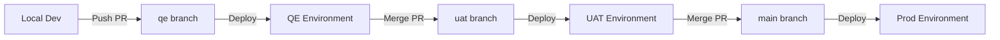

# AWS Production Deployment Plan (Local to AWS from Scratch)

This plan details the step-by-step preparation of the EmpathAI codebase for containerization and AWS deployment, as well as instructions for setting up the AWS resources from scratch.

## User Review Required

> [!IMPORTANT]
> **AWS Account Setup**: Since you do not currently have AWS configured, you will need to create a new AWS account, install the AWS CLI locally, and create an IAM User with appropriate administrator permissions (e.g. `AdministratorAccess`) to provision resources.
> We will guide you through this step-by-step before pushing any Docker containers or deploying the frontend.

> [!WARNING]
> **Secrets in Git**: We will strip the hardcoded Resend API key and OpenAI API key from the codebase and configure them to load from AWS Systems Manager (SSM) Parameter Store in production, keeping local defaults safe.

## Open Questions

> [!NOTE]
> Do you have a domain name registered (e.g., via GoDaddy, Route 53, etc.) that you plan to use for the staging or production hosting of the application? (This will determine how we set up Route 53 and AWS Certificate Manager (ACM) for HTTPS).

---

## Architectural Decision: ECS Fargate vs. Kubernetes (EKS)

Based on the target user scale (starting at ~50 users, with potential expansion to **2,000+ users**), we recommend using **AWS ECS Fargate** rather than Kubernetes (EKS).

* **Resource Adequacy:** At 2,000 registered users, peak concurrent traffic is estimated at 50–200 active users. ECS Fargate tasks running at minimal sizes (0.25–0.5 vCPU) can easily handle this load through simple container replicas.
* **Cost Efficiency:** ECS Fargate has no base control-plane fee, costing ~$25–45/month per environment. EKS has a flat control plane fee of ~$73/month per cluster (which would be ~$220/month across QE, UAT, and Prod before adding database or compute nodes).
* **Zero Maintenance:** ECS Fargate is fully serverless. AWS handles host patching, Kubernetes version upgrades, and control-plane maintenance, removing DevOps overhead.
* **Future Migration:** Since the services are fully containerized via Docker, migrating to EKS in the future (if scaling to 50,000+ users or dozens of microservices) will be straightforward.

---

## Environment Strategy

We will establish three identical environments (VPCs or resource-prefixed namespaces) to ensure safe feature progression:

| Environment | Purpose | Database Tier | ECS Task Configuration |
| :--- | :--- | :--- | :--- |
| **QE (Quality Engineering)** | Automated/manual developer testing | RDS PostgreSQL (`db.t4g.micro`) | Backend: 0.25 vCPU / 0.5 GB RAM<br>AI: 0.25 vCPU / 0.5 GB RAM |
| **UAT (User Acceptance)** | Pre-production validation / client reviews | RDS PostgreSQL (`db.t4g.micro`) | Backend: 0.25 vCPU / 0.5 GB RAM<br>AI: 0.25 vCPU / 0.5 GB RAM |
| **Prod (Production)** | Live environment serving end users | RDS PostgreSQL (`db.t4g.small` + snapshots) | Backend: 0.5 vCPU / 1.0 GB RAM<br>AI: 0.5 vCPU / 1.0 GB RAM |

---

## Workspace & Configuration Directory Structure

To manage multiple environments cleanly without duplicating source code, configuration and CI/CD files are organized as follows:

```
EmpathAI/
├── .github/
│   └── workflows/
│       ├── deploy-backend.yml      # CI/CD deployment configuration for Backend
│       ├── deploy-ai.yml           # CI/CD deployment configuration for AI Service
│       └── deploy-frontend.yml     # CI/CD deployment configuration for Frontend
├── EmpathaiBackend/
│   ├── src/main/resources/
│   │   └── application.properties  # Parameterized environment properties
│   └── Dockerfile                  # Multi-stage Java build
├── EmpathaiAI/
│   ├── graph/                      # AI logic & routing pipelines
│   └── Dockerfile                  # Python dependencies & execution
├── EmpathaiFrontend/
│   ├── src/
│   └── vite.config.js              # Vite server & API routing configuration
└── README.md
```

---

## Code Promotion Flow

We enforce a structured, branch-based promotion model to safely move code from local workstations up to Production:



### Steps for Promotion:

1. **Local to QE (Quality Engineering):**
   * Developers work on local branches (`feature/name` or `bugfix/name`).
   * When ready, create a Pull Request (PR) targeting the `qe` branch.
   * Merging into `qe` triggers GitHub Actions to build Docker images (tagged with target env and commit hash) and deploy them to the **QE ECS Fargate service**.
   * QA validation is performed here.

2. **QE to UAT (User Acceptance Testing / Staging):**
   * Once testing in QE passes, a PR is created to merge the `qe` branch into the `uat` branch.
   * Merging into `uat` triggers GitHub Actions to deploy to the **UAT ECS Fargate service**.
   * Internal stakeholders and client representatives test/approve the build here.

3. **UAT to Production:**
   * After UAT approval, a final PR is created to merge the `uat` branch into the `main` branch.
   * Merging into `main` builds, tags as `:latest`, and deploys the container images to the **Production ECS Fargate service**, updating the live system.

---

## Proposed Changes

### 1. Frontend

#### [MODIFY] [SetPassword.jsx](file:///c:/empathai_updated_new/EmpathAI/EmpathaiFrontend/src/components/SetPassword.jsx)
- Update the hardcoded `API_BASE` (currently `http://localhost:8081`) to use `import.meta.env.VITE_API_BASE_URL || ''`.
- This ensures it correctly routes through the Vite proxy locally (to port `8080` instead of `8081` which was causing failures) and runs relative to the domain root in production behind CloudFront.

---

### 2. Backend

#### [MODIFY] [application.properties](file:///c:/empathai_updated_new/EmpathAI/EmpathaiBackend/src/main/resources/application.properties)
- Parameterize all external resources and credentials using Spring's environment variable interpolation syntax `${ENV_VAR_NAME:default_value}`.
- Specific variables to parameterize:
  - Database URL, username, and password
  - JWT Secret key
  - AI Service URL (`chatbot.ai-service.url`)
  - ChromaDB URL (`chromadb.url`)
  - Resend API key (`resend.api-key`)
  - OpenAI API key (`openai.api.key`)
  - Frontend domain URL (`app.frontend.url`)
  - CORS allowed origins (`cors.allowed-origins`)

#### [NEW] [Dockerfile](file:///c:/empathai_updated_new/EmpathAI/EmpathaiBackend/Dockerfile)
- Create a multi-stage Docker build file:
  - **Stage 1 (Build)**: Build the jar using `maven:3.9.6-eclipse-temurin-17-alpine`.
  - **Stage 2 (Run)**: Package the jar into `eclipse-temurin:17-jre-alpine` for a lightweight and secure runtime.

---

### 3. AI Service

#### [NEW] [Dockerfile](file:///c:/empathai_updated_new/EmpathAI/EmpathaiAI/Dockerfile)
- Create a Python 3.10-slim Dockerfile:
  - Install dependencies (`build-essential`, `curl`).
  - Copy and install requirements (`requirements.txt`).
  - Copy codebase and configure default command to start `uvicorn` on port `8000`.

---

### 4. CI/CD Workflows

#### [NEW] [deploy-backend.yml](file:///c:/empathai_updated_new/EmpathAI/.github/workflows/deploy-backend.yml)
- Create a GitHub Actions workflow to automatically build the backend Docker image, push it to AWS ECR, and update the ECS Fargate service when pushing to the `main` branch.

#### [NEW] [deploy-ai.yml](file:///c:/empathai_updated_new/EmpathAI/.github/workflows/deploy-ai.yml)
- Create a similar GitHub Actions workflow to build and deploy the Python AI Service to ECR and ECS.

---

## AWS Setup Guide (From Scratch)

We will execute the following steps sequentially to set up AWS:

### Step A: Local AWS CLI Setup
1. Download and install the AWS CLI on your local machine.
2. Log into the AWS Console and create an IAM User with `AdministratorAccess` (for provisioning infrastructure).
3. Generate Access Keys for this IAM User.
4. Run `aws configure` locally to input these keys, specifying your default region (e.g. `us-east-1`).

### Step B: Core Network (VPC) & Security Groups
1. Create a VPC with Public Subnets (for ALB/CloudFront entry) and Private Subnets (for Backend, AI, ChromaDB, and RDS).
2. Configure Security Groups ensuring only:
   - ALB accepts public traffic on `80` and `443`.
   - Backend accepts traffic *only* from the ALB Security Group on port `8080`.
   - AI Service accepts traffic *only* from the Backend Security Group on port `8000`.
   - ChromaDB accepts traffic *only* from the AI Service Security Group on port `8001`.
   - RDS accepts traffic *only* from the Backend Security Group on port `5432`.

### Step C: Databases Setup
1. **RDS PostgreSQL**: Provision a Single-AZ RDS instance (Free Tier `db.t4g.micro` for testing). 
2. **Persistent ChromaDB (EFS)**: Provision an Amazon EFS volume. Mount this volume to `/chroma/chroma` within the ChromaDB ECS Task Definition to persist vector index files.

### Step D: Secrets Provisioning (SSM Parameter Store)
1. Add SSM SecureString parameters for all environment variables:
   - `/empathai/prod/DB_URL`
   - `/empathai/prod/DB_USER`
   - `/empathai/prod/DB_PASSWORD`
   - `/empathai/prod/JWT_SECRET`
   - `/empathai/prod/OPENAI_API_KEY`
   - `/empathai/prod/RESEND_API_KEY`
   - `/empathai/prod/DEFAULT_ADMIN_EMAIL`
   - `/empathai/prod/DEFAULT_ADMIN_PASSWORD`

### Step E: ECS Fargate Cluster & Service Configuration
1. Create ECR repositories for Backend and AI Service.
2. Build and push the Docker containers to ECR.
3. Create ECS Task Definitions for Backend, AI, and ChromaDB, mapping SSM parameters to environment variables.
4. Configure ECS Services inside the private subnets.
5. Provision the ALB to expose path `/api/*` to the Backend Service.

### Step F: Frontend S3 + CloudFront Hosting
1. Create a private S3 bucket `empathai-frontend-prod`.
2. Provision a CloudFront distribution pointing to S3 as default origin, and ALB as `/api/*` origin.
3. Configure Origin Access Control (OAC) for secure S3 fetches.

---

## Verification Plan

### Automated Tests
- Build and run the dockerized backend and AI service containers locally to verify they start and integrate correctly:
  `docker build -t empathai-backend ./EmpathaiBackend`
  `docker build -t empathai-ai ./EmpathaiAI`

### Manual Verification
- Verify the frontend local development build starts and correctly talks to the backend on the relative path `/api/*` once the `SetPassword` API path is changed.
